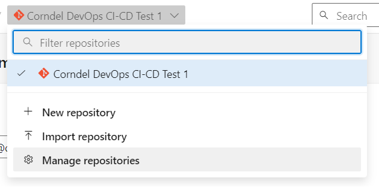

# Continuous Delivery Workshop Instructions

## Import the repository into Azure DevOps

Along with those in your breakout room you will have access to an ADO "project", so at this point sign into ADO at <https://aex.dev.azure.com/> and check that you can locate that. If you don't have your Azure credentials or the Organisation doesn't show up, ask a trainer at this stage. You may be able to access it directly at <https://dev.azure.com/CorndelDevOpsPipelinesWorkshop/>.

By default we suggest you *each* work on a separate repository. You should have the correct number of repos created already - so select the "Repos" tab on the left, select the name of the initial repository at the top, and select "Manage Repositories". Choose one of the repos and rename it with your name so that you know whose is whose.



Clone your repository onto the machine you'll be working on, and you're ready to start setting up the app.

> The easiest way to do this is to use HTTPS and use the "generate credentials" option when it asks for a password. Make a note of this in case you need it later

## Part 1 (Publish to Docker Hub)

Before we deploy our application, we are going to containerise it. In addition to the consistency advantage of knowing our deployed solution should run very similarly to our local container, another advantage of deploying a container is that we are less directly tied in to a particular hosting platform; many cloud providers provide various routes for running containers which gives us flexibility when selecting or even changing our architecture.

### Build the Docker Image

We have provided the outline of a Dockerfile so that you can run the DotnetTemplate web app in a Docker container; you should check that you can build & run this image. Note that if this runs slowly, it's reasonable to skip this stage, and just get Azure to run it for you.

To build:

`docker build --target runtime --tag dotnettemplate .`

To run:

`docker run -it -p 5000:5000 dotnettemplate`

Take a look at the Dockerfile, can you see what it's doing?

> In particular, this image tries to reduce its footprint by using a different base image for the final result than the base image with all the necessary tooling used to compile the application.

> Try building the initial image stage with `docker build --target build-stage --tag intermediate .`, and compare its size through Docker Desktop or `docker image ls`.

### Manually publish to Docker Hub

1. Create a personal free account on [Docker Hub](https://hub.docker.com/) (if you haven't already).
2. Create a public repository in Docker Hub: https://hub.docker.com/repository/create. Don't connect it to GitHub, and name it dotnettemplate.
3. Build your Docker image locally and push it to Docker Hub. See https://docs.docker.com/docker-hub/repos/ for instructions. 
  a. (Remember you'll need to tag it with `<your_dockerhub_username>/dotnettemplate` e.g. `--tag johndoe/dotnettemplate`)

### Automatically publish to Docker Hub

You will see that the repository already has a pipeline defined which should handle running your tests etc. Take a look and check you understand what it's doing. Once you've verified it passes, for today it's OK for speed reasons to change the value of the "skip-testing" parameter to `true`.

We now want to extend that pipeline to build & publish our Docker image to DockerHub.

Add a new job to your `azure-pipelines.yml` file, that handles pushing your image to DockerHub. It will need to:
* Login to Docker
* Build & tag the image
* Push the image to DockerHub

We've already written the commands to do that locally, but let's take advantage of the [Docker task](https://learn.microsoft.com/en-us/azure/devops/pipelines/tasks/reference/docker-v2?view=azure-pipelines&tabs=yaml) provided by ADO.

Either way, we'll need to provide credentials to access DockerHub - generate [a Personal Access Token in DockerHub](https://docs.docker.com/security/for-developers/access-tokens/) now, so that we don't need to provide your password. This can then be decommissioned after the workshop safely.

> If you want to try this step manually without the Docker Task, make sure to set your access token as [a secret variable for your pipeline](https://learn.microsoft.com/en-us/azure/devops/pipelines/process/set-secret-variables?view=azure-devops&tabs=yaml%2Cbash)!

In order to use the Docker task, we need to authorize our pipeline to talk to DockerHub on our behalf, and we can do this with a ["Service Connection"](https://learn.microsoft.com/en-us/azure/devops/pipelines/library/service-endpoints?view=azure-devops&tabs=yaml).

In your ADO Project Settings (bottom left corner) go to "Service Connections" and create a new one:
* Docker Registry
  * Select type `DockerHub`
  * Enter your Docker ID and use the access token as the password
  * Give the connection a name

You can now use the [Docker task](https://learn.microsoft.com/en-us/azure/devops/pipelines/tasks/reference/docker-v2?view=azure-pipelines&tabs=yaml) - have a go at getting your pipeline to publish your image now.

### Test your workflow

Once that's reporting successful in ADO, we should check it! To test that publishing to Docker Hub is working:
1. Make some change to the application code. Don't worry if you don't know anything about C#, find some visible text to modify in DotnetTemplate.Web/Views/Home/FirstPage.cshtml.
2. Commit your changes to git, and push them.
3. Check your pipeline completes successfully.
4. Download and run your new image from Docker Hub (or you could also get someone else to).

### Publish only on main
Modify the workflow so that it will only publish to Docker Hub when run on certain branches, for example only when the main branch is updated.

## Part 2 (Deploy to Azure)

### Deploy to Azure manually

1. Sign into [the Azure portal](https://portal.azure.com/).
2. Locate your resource groups. You should find you have two, one ending with `_Workshop` which we'll be using today.
> A resource group is a logical container into which Azure resources, such as web apps, databases, and storage accounts, are deployed and managed. [More Azure Terminology can be found here](https://learn.microsoft.com/en-us/azure/azure-resource-manager/management/overview#terminology).
3. Create a Web App to run our container
<details><summary> Click for instructions using the portal </summary>

  * From within your Resource Group, select the "Create" option at the top
  * Select the "Web App" option shown, or if you can't see it then search for it
    * We want precisely "Web App", watch out for & avoid similar resources such as "Static Web App" or "Web App for Containers"
  * Set the relevant options:
    * Make sure the Resource Group points to your `_Workshop` group
    * Choose a name for your app - this will need to be globally unique so including your initials may be sensible
    * For the "Publish" option, select "Docker Container"
    * Under “App Service Plan”, it should default to creating a new one, which is correct. Just change the “Sku and size” to “B1”.
    * On the next screen, select Docker Hub in the “Image Source” field, and enter the details of your image.
</details>
<details><summary> Click for instructions using the CLI </summary>

* First make sure that you've logged into the right account with `az login` (or `az login --use-device-code` on GitPod)
  * You can check which account you're logged into with `az account list`
* First create an App Service Plan: `az appservice plan create --resource-group <resource_group_name> -n <appservice_plan_name> --sku B1 --is-linux`
* Then create the Web App: `az webapp create --resource-group <resource_group_name> --plan <appservice_plan_name> --name <webapp_name> --deployment-container-image-name docker.io/<dockerhub_username>/<container-image-name>:latest`
  </details>
<br>

4. Configure the [`WEBSITES_PORT` app setting](https://learn.microsoft.com/en-us/azure/app-service/configure-custom-container?tabs=debian&pivots=container-linux#configure-port-number) which identifies which port in the container requests should be forwarded to (which will be port 5000 for your container image).
5. You can see the app running by using the "Browse" button from within the new resource's overview page or by visiting `https://<webapp_name>.azurewebsites.net` directly.

> Troubleshooting:
>
> 1: Deployment logs can be found the Deployment Center tab on the App Service's page in the Azure portal.
>  * This only covers pulling and running the container image. For logs not related to deployment please consult the *Log Stream* tab
>
> 2: You can trigger a redeployment of the container image by calling the Webhook URL with a POST request ([see the next section below](#calling-the-deployment-webhook)).
>  * This is necessary if you have updated the container image on Docker hub *after* creating the App Service (restarting the App Service will *not* trigger a redeployment!)
>
> 3: If you see the following message when deploying from an M1/M2 Mac:
> ```
> 2023-02-02T10:33:51.938273952Z standard_init_linux.go:228: exec user process caused: exec format error
> ```
> Then it's possible the container image has been built with the wrong architecture. To fix this pass the `--platform linux/amd64` flag when running `docker build`.


### Automate deployment to Azure

Simply pushing a new image to DockerHub will not re-deploy your app service by default. We can enable that behaviour for specific container registries (including DockerHub) by [switching on the "Continuous Deployment" option](https://learn.microsoft.com/en-us/azure/app-service/deploy-ci-cd-custom-container?tabs=acr&pivots=container-linux#4-enable-cicd) in the "Deployment Center", but for today we'll set this up manually so we can see what's going on and better control it.

#### Calling the Deployment Webhook
To automate this, you will first need to find your Web App's deployment webhook under the "Deployment Center" tab from your Web App.

Test that now by running a curl command locally from a bash shell:
* Take the webhook provided by the previous step, add in a backslash to escape the $, and run: `curl -dH -X POST "<webhook>"`
* eg: `curl -dH -X POST "https://\$<deployment_username>:<deployment_password>@<webapp_name>.scm.azurewebsites.net/docker/hook"`

This should return a link to a log-stream relating to the re-deployment of your application.

Once you've demonstrated that working locally, we want to add that behaviour onto your pipeline.

First, register your webhook as a secret variable for your pipeline:
* Navigate to your pipeline in the ADO interface
* Click "Edit"
* Click on "Variables" in the top right
* Add a new variable called e.g. `AZURE_WEBHOOK`, add the value, and mark it as secret

Now add the relevant curl command as a final "script" step in your deployment job pipeline. Note that ["secret" variables aren't automatically available as environment variables](https://learn.microsoft.com/en-us/azure/devops/pipelines/process/set-secret-variables?view=azure-devops&tabs=yaml%2Cbash#use-a-secret-variable-in-the-ui), you need to explicitly map them, like:
```yml
- script: echo "My secret variable: $FOO"
  env:
    FOO: $(MySecretVariable) 
```

> A nice addition here can be adding the [--fail](https://curl.se/docs/manpage.html#-f) flag to your curl command, as otherwise curl reports success as long as a successful connection was made, even if the response reports a failure (e.g. a status code > 400) which can lead to confusing pipeline results

Check that your pipeline output still shows the log-stream result after making the `curl` request.

### Test your workflow again

Make a small, visible change again, push it to your repository and check that it automatically shows up on your deployed Azure website.

### Reflect!

At this stage, we have a pipeline such that any code, once modified, will be immediately deployed to our web app. What advantages does this have over batching releases? What disadvantages does it have?

### (Stretch Goal) Track our changes!

So far we've just been getting on with the work, but we really ought to be tracking it carefully. Let's see how ADO can help us track the work.

This project is currently configured to have the Boards use the "Agile" process - ADO offers several in-built flows so you may work with different terminology; [Azure offer more info on those here](https://learn.microsoft.com/en-us/azure/devops/boards/work-items/guidance/choose-process?view=azure-devops&tabs=agile-process#default-processes).

Go to "Boards" and raise a new "Work Item" of type "Issue". Give yourself a simple task, such as "Change the text on the homepage".

Take a moment to look at what fields are offered to be tweaked, such as the state ("To Do" etc.), the priority, and a more detailed description, then save the issue.

Make a note of the issue number, and check that appears as you'd expect on the "Boards" view. One nice feature of ADO is that we can easily associate branches, PRs and individual commits with work items. First, check this is enabled for your repository through:
* Project Settings
* Repositories -> your repo
* Settings
* Check "Commit mention linking" is on

> You may notice that we can take this one step further, as there's also an option for:
> "Commit mention work item resolution"
> "Allow mentions in commit comments to close work items (e.g. "Fixes #123")."
> Leave this off for now

Now move the ticket into the "Doing" stage, and then get going!

Make a small visible change to the code, for example change the `First Page!` title in `DotnetTemplate.Web\Views\Home\FirstPage.cshtml`. When you're ready to make the change, make sure to include `#<issue_number>` as part of your commit message, e.g.:
```bash
git commit -m "#14 Change the homepage text"
```

Push your change to main, and check the deployment succeeds. If you open the ticket, can you see a link to the relevant commit?

### (Stretch Goal) Separate Production Environment

So far we've relied on Continuous Deployment to our web service, but the Product Owner is now insisting that we add a separate production environment which requires their approval on all releases.

There are lots of ways we could set up a new environment in our architecture, such as using [deployment slots](https://learn.microsoft.com/en-us/azure/app-service/deploy-staging-slots?tabs=portal) but today let's use a cheap approach!

Create a new app service in your resource group that will function as production, but this time use your _existing_ app service plan rather than creating a new one. That just means the two applications are sharing the underlying resources, and therefore share the cost!

In the Docker settings stage, use the same image name, but this time use a `prod` tag, e.g.: `<username>/dotnet-demo:prod` rather than `<username>/dotnet-demo` or `<username>/dotnet-demo:latest`.

Within the pipelines section of ADO, select "Environments" and create a new Environment (without resources). Click into the environment, select "Approvals and Checks" and add an approval check - assign another person in your breakout room, or the trainer (and set a timeout for 30 minutes).

We can now write the production step of our pipeline. There are various ways to do this, but one might be:
* Create a new yaml file, with a totally separate pipeline
* Set the `trigger` to `none` so that it can only be run manually
* Create a "deployment" job ([see example](https://learn.microsoft.com/en-us/azure/devops/pipelines/process/create-multistage-pipeline?view=azure-devops#add-the-dev-stage))
* Link it to the environment you created
* Push your code, and register the new pipeline in ADO
* Finally, run the pipeline, and check that it waits for approval!
  * Does it successfully deploy to prod once it passes approval?

### (Stretch goal) Pick another CI tool to compare
The fundamentals of different CI/CD tools are often very similar, but the syntax and specifics can be quite different. Can you see how you could apply the same pipeline in another tool, such as GitHub actions or GitLab pipelines?

### (Stretch goal) Monitor for failure
Failures don't always happen immediately after a deployment. Sometimes runtime issues will only emerge after minutes, hours or days in production. Set up a separate workflow which will hit your index page and send a notification if the page fails to load. Make sure this workflow runs every 5 minutes. Hint: <https://learn.microsoft.com/en-us/azure/devops/pipelines/process/scheduled-triggers?view=azure-devops&tabs=yaml>

Once you've seen this run successfully, for today we should switch it off to save pipeline time.

### (Stretch goal) Healthcheck
Sometimes the build, tests and deployment will all succeed, however the app won't actually run. In this case it can be useful if your workflow can tell you if this has happened. Modify your workflow so that it does a healthcheck.

As part of this it can be useful to add a new healthcheck endpoint to the app, see [this microsoft guide](https://docs.microsoft.com/en-us/aspnet/core/host-and-deploy/health-checks?view=aspnetcore-5.0#basic-health-probe) for an example of how to do this. This article is long and detailed, and that can make it look intimidating - but everything we need to know is just in the "Basic health probe" section. Try working through it! You should find that we can add this healthcheck endpoint with just two lines of code.

At the end of your workflow, check that the response from the healthcheck endpoint is correct.

### (Stretch goal) Handle failure
How would you handle failure, for example if one of the healthchecks from the previous two steps fail? Modify your existing workflows so that they will automatically roll-back a failed Azure deployment. Make sure they send an appropriate alert! Find a way to break your application and check this works.
